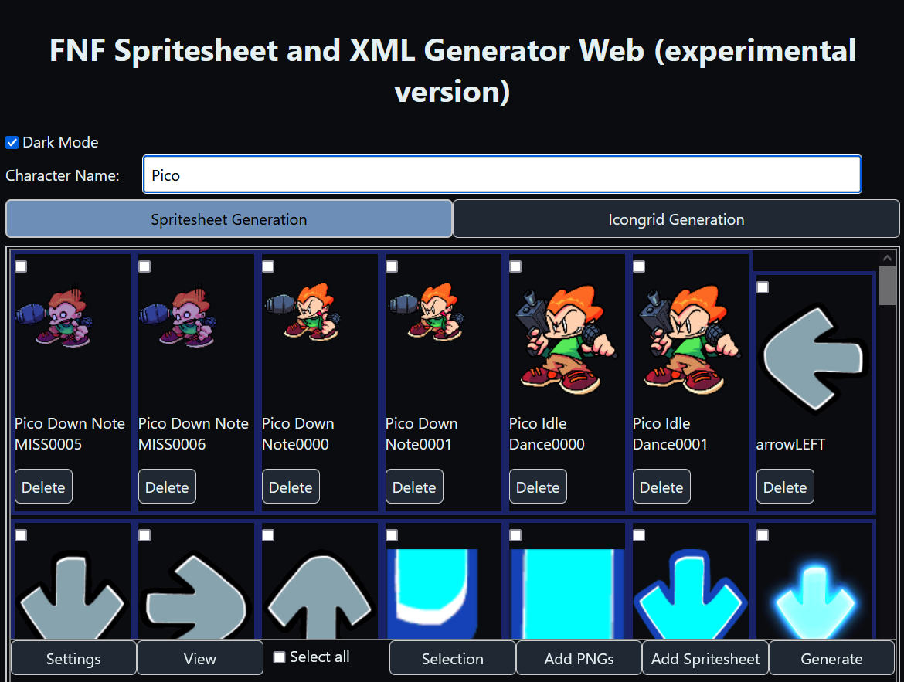
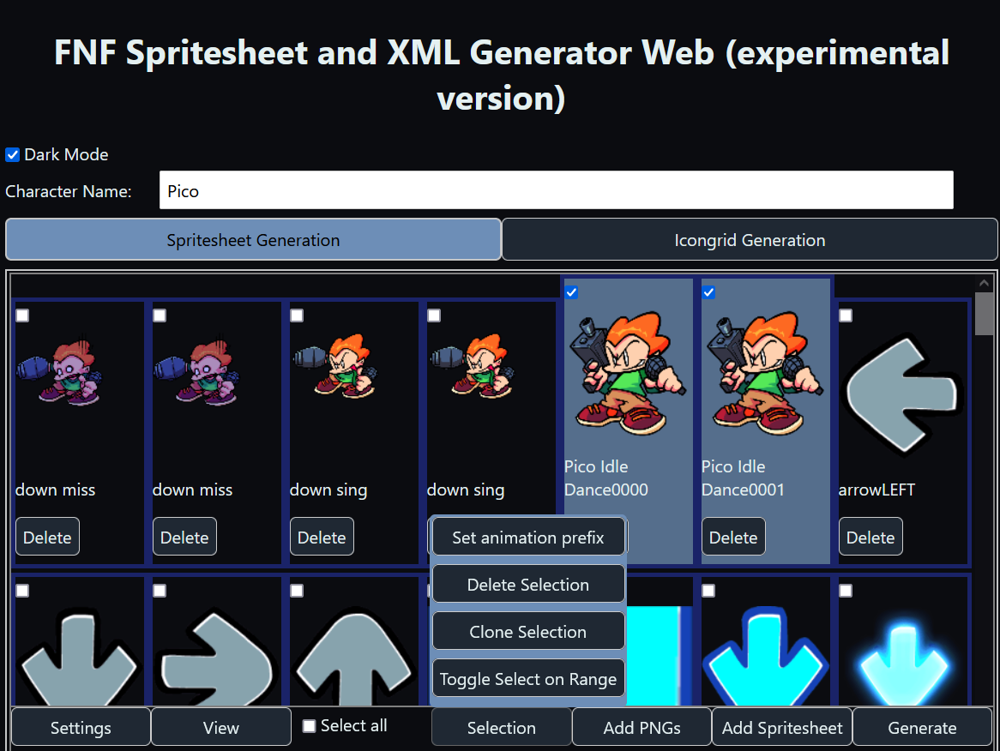
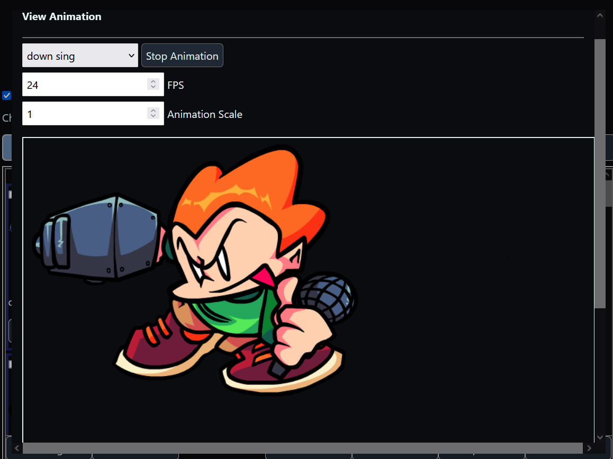
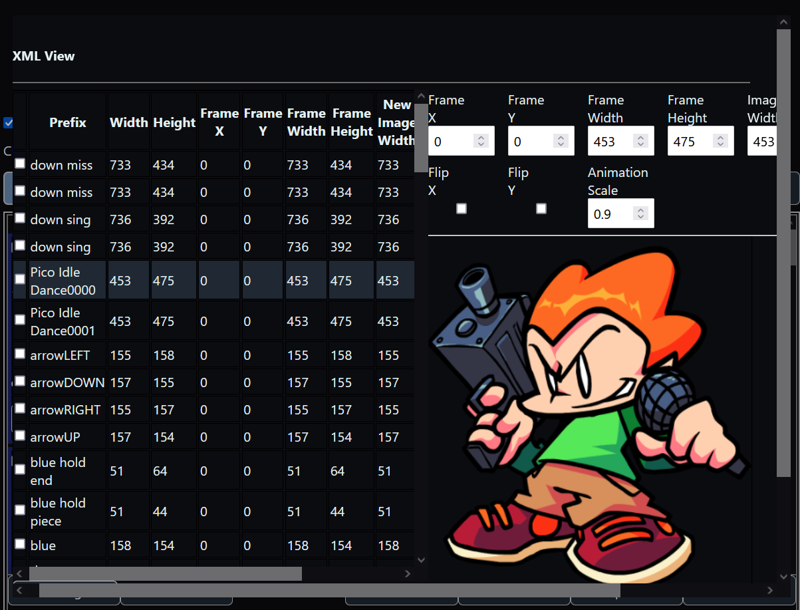
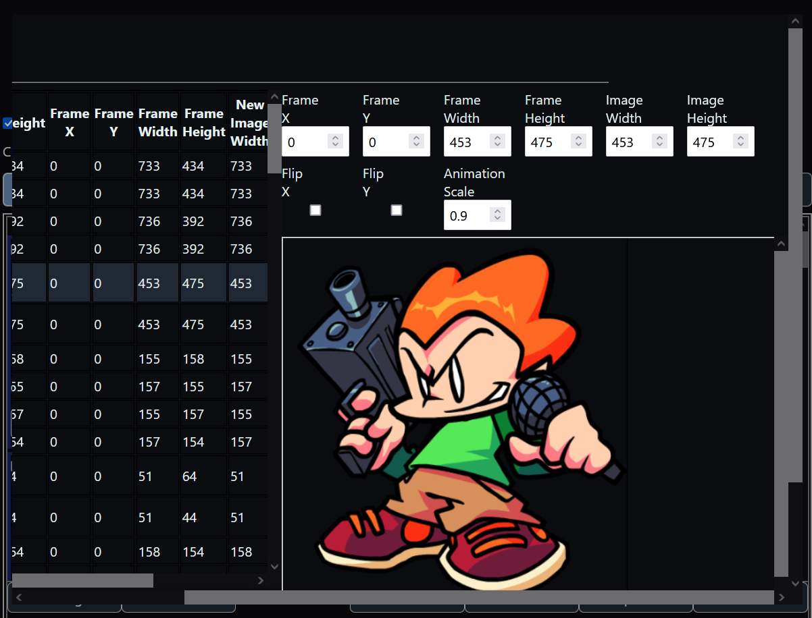

# FnF-Spritesheet-and-XML-Maker-Web
An (experimental) online version of the [FnF-Spritesheet-and-XML-Maker](https://github.com/UncertainProd/FnF-Spritesheet-and-XML-Maker), A Friday Night Funkin' mod making helper tool that allows you to generate XML files and spritesheets from individual pngs. This is a free and open-source mini-replacement tool to the "Generate Spritesheet" functionality in Adobe Animate/Flash

### This tool can be used online by following [this link](https://uncertainprod.github.io/FNF-Spritesheet-XML-generator-Web). Tested mainly on Chrome and Firefox browsers

<!--  -->

## How to generate spritesheet and XML files for your character:

First, the name of your character goes into the textbox at the top. This is necessary as the final xml and png files will be named accordingly.
Eg: If you name you character <b>Pixel-GF</b> the files generated will be named <b>Pixel-GF.png</b> and <b>Pixel-GF.xml</b>
If this box is blank, you will be prompted for a name when generating the spritesheet.

### Adding sprite frames
To add a frames from PNG images, click on `Add PNGs`, and then select all the PNG images you want to insert as frames. 

If you want to extract and add frames from a pre-existing Spritesheet and XML, click on `Add Spritesheet`. It will then prompt you to insert your spritesheet and your XML and extract the frames from it.

Once you have added some frames it will look like this:

<!--  -->
 
 
Click on some frames whose animation prefix you want to set and then click the `Set animation prefix` button as shown below:

<!--  -->
<!--  -->

Once you click the `Set animation prefix` button in the dialog, it will set that animation name for all the frames that are selected.

### Previewing The Animations
By click on `View` > `View Animation`, you can select the name of the animation you want to see and click the play button to play that animation. In case the animation is too big (usually on phone screens), you can change the `Animation Scale` to reduce the size of the animation for better visibility.
<!--  -->

### Tweaking the sprite frames
By going into `View` > `View XML structure`, you can change the appearance of each sprite frame. It supports scaling, flipping and changing the values of `frameX`, `frameY`, `frameWidth` and `frameHeight`.

<!--  -->
<!--  -->

### Generating the final XML and PNG files
When you're done adding all the frames and giving them animation names, it's time to generate the final PNG and XML files!
To do so, just click the "Generate XML" button. This will download a zip file containing the final Spritesheet and the XML. This could take a while depending on how large the input spritesheets/frames are.
 

### Important thing to know when uploading large spritesheets:
Since the app runs entirely in the browser, all images are that are loaded are kept in memory by the browser. So expect the memory usage of your browser to increase (sometimes by a _lot_) when using this app.

Also try not to upload spritesheets that are too big (aka several gigabytes) in size, as there is a chance that it might _really_ slow down (or worse, crash) your browser while the frames are being processed, or while the final spritesheet is being generated.
  

## Making Icons / Icongrids
You can create icons by just clicking on `Add Icons`, then selecting 2 icon png files of size 150 x 150 and then clicking `Generate Icongrid`. This generates an icongrid that can be used.

The app also supports making Icongrids (mainly only used by the pre-week 7 base engine), where you can upload an icongrid, then choose the icons you wish to add and then click `Generate Icongrid`. This legacy feature can be enabled by checking the `Legacy Mode` checkbox.
 
 

## Building the app:
Since this is a web app, there is no need to build this from source if all you intend on doing is using the app. Just use the app [here](https://uncertainprod.github.io/FNF-Spritesheet-XML-generator-Web)

But for developers, you need the [Rust](https://www.rust-lang.org/tools/install) toolchain as well as [Node.js (and npm)](https://nodejs.org/en/download) installed. You also need `wasm-pack` to compile Rust into Webassmebly, follow the instructions [here](https://rustwasm.github.io/docs/book/game-of-life/setup.html) for setting that up.

- To build the app go into the `svelte-frontend` folder and open a command prompt/terminal window in that folder
- Type in `npm install` to automatically install all the dependencies needed for both the Javascript code
- Then type `npm run dev` to start the app in debug mode. In order to build in release mode use `npm run build` instead. The first build will take a while as all the Rust dependencies will have to get downloaded and compiled before building the app.

<small>Note: This app is still in a WIP phase and is not fully fleshed out yet (especially the UI) but it supports pretty much everything that the older application supported</small>

#### Side note: Credit this repo if you are going to make your own fork and stuff :)